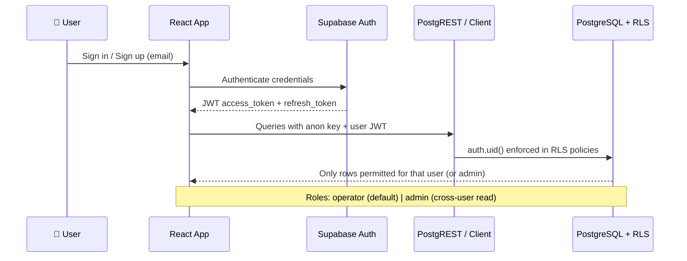
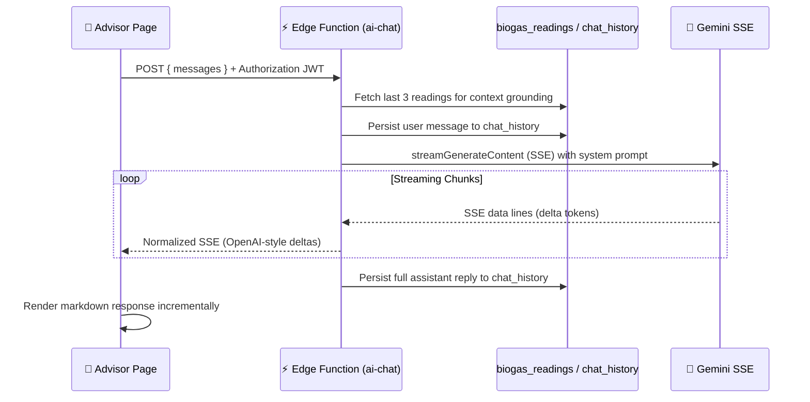
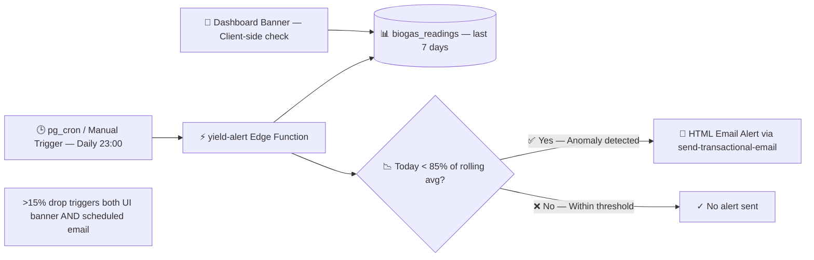
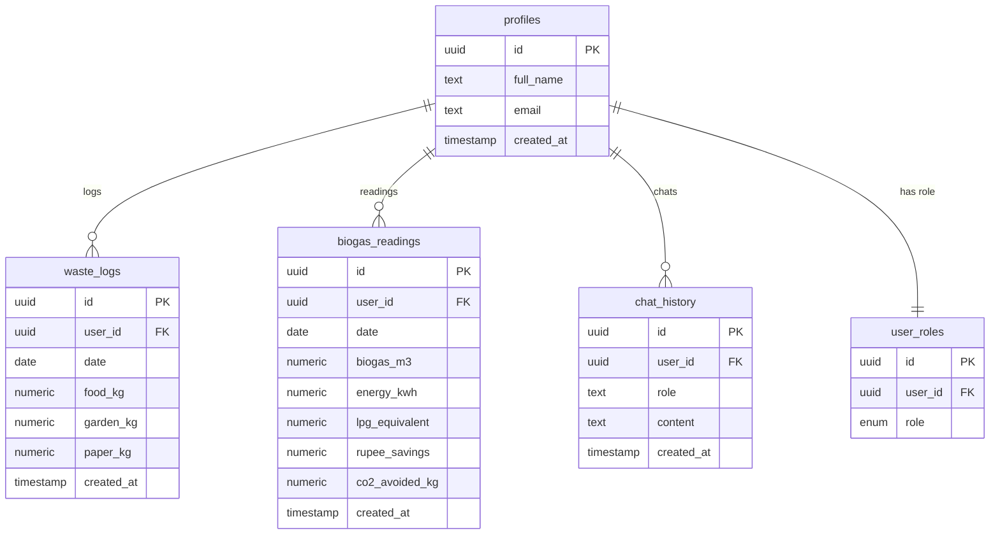

<div align="center">


# 🌿 BioUrja

### AI-Powered Waste-to-Biogas Analytics Platform

**Real-time plant performance monitoring · AI-driven insights · Anomaly detection**

[🚀 Live Demo](https://biourja.onrender.com/) · [📖 Documentation](#-installation--setup) · [🐛 Issues](https://github.com/Alokkumar2228/BioUrja/issues) · [⭐ Star this Repo](https://github.com/Alokkumar2228/BioUrja)

</div>

---

## 📌 Table of Contents

- [Project Overview](#-project-overview)
- [Live Demo & Deployment](#-live-demo--deployment)
- [Tech Stack](#-tech-stack)
- [System Architecture](#-system-architecture)
- [Key Features](#-key-features)
- [Installation & Setup](#-installation--setup)
- [Security Features](#-security-features)
- [Performance Optimizations](#-performance-optimizations)
- [Author](#-author)
- [Acknowledgments](#-acknowledgments)
- [Future Enhancements](#-future-enhancements)

---

## 🌱 Project Overview

**BioUrja** is a production-grade, AI-powered waste-to-biogas analytics platform that enables biogas plant operators to **monitor, analyze, and optimize plant performance in real time** using AI-driven insights and anomaly detection. The in-app experience is branded as **BiogasIQ** — encompassing the AI advisor, automated reports, and dynamic dashboards.

### 💡 What It Does

Operators log **daily organic waste inputs** by category — food scraps, garden waste, and paper — and BioUrja's server-side engine instantly derives:

| Derived Metric | Description |
|---|---|
| 🔥 **Biogas Yield (m³)** | Gas volume produced from waste composition |
| ⚡ **Energy Output (kWh)** | Electrical equivalent from biogas combustion |
| 🪔 **LPG-Equivalent Savings** | Equivalent LPG cylinders displaced |
| 💰 **Rupee Savings** | Monetary value of energy generated |
| 🌍 **CO₂ Avoided (kg)** | Carbon emissions offset by renewable gas |

These metrics are visualized on **interactive Recharts dashboards**, monitored for anomalies, and analyzed by a **streaming Gemini AI advisor** that answers operational questions with live plant context.

### 🎯 Real-World Use Case

BioUrja targets **biogas plant operators, sustainability managers, and waste management facilities** across India and emerging markets who need affordable, intelligent tooling to maximize biogas yield and reduce operational blind spots — without expensive SCADA systems.

### 🏗️ Technical Impact

This is a **portfolio-grade full-stack reference project** demonstrating:
- End-to-end **React + TypeScript SPA** on **Vite**
- **Supabase Auth + PostgreSQL** with **Row-Level Security**
- **Deno Edge Functions** for secure, serverless mutations
- **SSE streaming** for real-time AI responses
- **Indexed time-series queries** for performant analytics
- **Dockerized Nginx** deployment for production hosting

---

## 🚀 Live Demo & Deployment

| Resource | Link |
|---|---|
| 🌐 **Live App (Frontend)** | *[Add your deployed URL — Vercel / Netlify / Cloudflare Pages]* |
| 📦 **Source Code** | [github.com/Alokkumar2228/BioUrja](https://github.com/Alokkumar2228/BioUrja) |
| 🔧 **Supabase Backend** | `https://<YOUR_PROJECT_REF>.supabase.co` |
| ⚡ **Edge Functions** | `https://<YOUR_PROJECT_REF>.supabase.co/functions/v1/<function-name>` |
| 🐞 **Issue Tracker** | [GitHub Issues](https://github.com/Alokkumar2228/BioUrja/issues) |

> 💬 **Demo credentials:** *Add test login credentials if public demo is configured*

---

## 🛠️ Tech Stack

### 🖥️ Frontend

| Technology | Version | Purpose |
|---|---|---|
| [React](https://react.dev/) | 18 | UI component framework |
| [TypeScript](https://www.typescriptlang.org/) | 5.8 | Type-safe development |
| [Vite](https://vitejs.dev/) | 5 | Lightning-fast build tool & dev server |
| [React Router](https://reactrouter.com/) | v6 | Client-side SPA routing |
| [Tailwind CSS](https://tailwindcss.com/) | latest | Utility-first styling |
| [shadcn/ui](https://ui.shadcn.com/) | latest | Accessible Radix UI component primitives |
| [Recharts](https://recharts.org/) | latest | Composable dashboard charts |
| [Lucide React](https://lucide.dev/) | latest | SVG icon library |
| [next-themes](https://github.com/pacocoursey/next-themes) | latest | Dark/light mode theming |
| [Sonner](https://sonner.emilkowal.ski/) | latest | Toast notifications |

### 📡 State Management & Data Fetching

| Technology | Purpose |
|---|---|
| [TanStack React Query](https://tanstack.com/query) | Server state, caching & refetching |
| [@supabase/supabase-js](https://supabase.com/docs/reference/javascript) | Supabase client (Auth, DB, Realtime) |

### 📋 Forms & Validation

| Technology | Purpose |
|---|---|
| [React Hook Form](https://react-hook-form.com/) | Performant form state management |
| [Zod](https://zod.dev/) | TypeScript-first schema validation |
| [@hookform/resolvers](https://github.com/react-hook-form/resolvers) | RHF + Zod integration |

### 🔧 Backend & Infrastructure

| Technology | Purpose |
|---|---|
| [Supabase](https://supabase.com/) | Managed Postgres, Auth, Edge Functions, Realtime |
| [PostgreSQL](https://www.postgresql.org/) | Relational database with RLS policies |
| [Deno](https://deno.land/) | Edge Function runtime (TypeScript-native) |

### 🤖 AI Integration

| Technology | Purpose |
|---|---|
| [Google Gemini API](https://ai.google.dev/) | `streamGenerateContent` + SSE streaming |
| System Prompt Engineering | Context-grounded on last 3 biogas readings |

### 🔐 Authentication

| Technology | Purpose |
|---|---|
| [Supabase Auth](https://supabase.com/auth) | JWT sessions, email auth, auto-refresh, localStorage persistence |

### 📄 Documents & Reports

| Technology | Purpose |
|---|---|
| [pdf-lib](https://pdf-lib.js.org/) | PDF report generation in `reports-pdf` Edge Function |
| [react-markdown](https://github.com/remarkjs/react-markdown) | Renders AI advisor Markdown responses |

### 🐳 DevOps & Deployment

| Technology | Purpose |
|---|---|
| [Docker](https://www.docker.com/) | Multi-stage build: Node builder → Nginx runtime |
| [Nginx](https://nginx.org/) | SPA static hosting with client-side routing fallback |
| [ESLint](https://eslint.org/) | Code linting |
| [Vitest](https://vitest.dev/) | Unit testing |
| [Testing Library](https://testing-library.com/) | Component testing utilities |

---

## 🏛️ System Architecture

### High-Level Overview

> Browser ↔ Supabase Auth + PostgREST (RLS) ↔ Deno Edge Functions (service role + user JWT) ↔ Gemini / PDF / Email

```mermaid
flowchart TB
  subgraph Client["🌐 Browser — React SPA (Vite)"]
    UI[Dashboard · Waste Logger · Advisor · Reports]
    RQ[TanStack Query]
    SB_CLIENT[@supabase-js client]
  end

  subgraph Supabase["☁️ Supabase Cloud"]
    AUTH[Auth — JWT]
    PG[(PostgreSQL + RLS)]
    EF[Edge Functions — Deno]
  end

  subgraph External["🔌 External Services"]
    GEMINI[Google Gemini API — SSE]
    EMAIL[Transactional Email]
    PDF[pdf-lib — Report Generator]
  end

  UI --> RQ
  UI --> SB_CLIENT
  SB_CLIENT --> AUTH
  SB_CLIENT --> PG
  UI -->|Bearer JWT| EF
  EF --> AUTH
  EF --> PG
  EF --> GEMINI
  EF --> EMAIL
  EF --> PDF
```

---

### 🔐 Authentication & RLS Flow



---

### 🤖 AI Advisor — Streaming Pipeline



---

### 🚨 Yield Anomaly Detection Pipeline



---

### 🗄️ Database Schema (Conceptual)



---

## ✨ Key Features

| Feature | Technical Details |
|---|---|
| 🔑 **Secure Authentication** | Email-based Supabase Auth; protected routes; auto-refresh JWT sessions |
| 📝 **Waste Logging** | Daily entry for food / garden / paper (kg); live output preview via shared `calculate()` utility |
| ⚡ **Server-side Persistence** | `save-waste` Edge Function inserts `waste_logs` + `biogas_readings` with server-side formula enforcement |
| 📊 **Interactive Dashboard** | KPI cards, Recharts line/bar/pie charts, 30-day rolling window, extrapolated annual biogas projection |
| 🚨 **Low-Yield Anomaly Alert** | Client banner when today's biogas is **>15% below** 7-day rolling average; mirrored server-side in `yield-alert` |
| 🤖 **Streaming AI Advisor** | Gemini SSE streaming with Markdown rendering; history in `chat_history`; context-grounded on last 3 readings + plant targets |
| 📄 **PDF Report Export** | Date-range aggregation, summary KPIs, tabular data; downloadable PDF via `reports-pdf` Edge Function using `pdf-lib` |
| 👥 **Role-Based Access Control** | `admin` / `operator` enum; `has_role()` security-definer function; admin cross-user read policies |
| 📧 **Automated Email Alerts** | `yield-alert` scans all users nightly, detects drops, sends branded HTML email via transactional email function |
| 🐳 **Dockerized Deployment** | Multi-stage build with Nginx SPA fallback; production-ready containerization |
| 🌙 **Dark / Light Mode** | System-aware theming via `next-themes` |
| 🧪 **Testing Suite** | Vitest + Testing Library; ESLint for code quality enforcement |

---

## ⚙️ Installation & Setup

### Prerequisites

Ensure the following are installed before proceeding:

- **Node.js 20+** and npm — [Download](https://nodejs.org/)
- **Supabase CLI** — [Install Guide](https://supabase.com/docs/guides/cli)
- **Docker** (optional) — for containerized hosting

---

### Step 1 — Clone & Install Dependencies

```bash
git clone https://github.com/Alokkumar2228/BioUrja.git
cd BioUrja
npm ci
```

---

### Step 2 — Configure Environment Variables

Create a `.env` file in the project root (⚠️ never commit this file):

```env
VITE_SUPABASE_URL=https://YOUR_PROJECT_REF.supabase.co
VITE_SUPABASE_PUBLISHABLE_KEY=your_supabase_anon_key
```

> The Supabase client is configured in `src/integrations/supabase/client.ts`.

---

### Step 3 — Database Setup

Apply all migrations to your Supabase project. Migrations (in `supabase/migrations/`) define:

- `profiles`, `user_roles`, `waste_logs`, `biogas_readings`, `chat_history` tables
- Row-Level Security (RLS) policies scoped to `auth.uid()`
- `handle_new_user` trigger for automatic profile + default `operator` role creation

**Option A — Supabase Dashboard SQL Editor:**
Copy and run migration files manually via the dashboard.

**Option B — Supabase CLI (when project is linked):**
```bash
supabase link --project-ref YOUR_PROJECT_REF
supabase db push
```

---

### Step 4 — Configure Edge Function Secrets

Navigate to **Supabase Dashboard → Edge Functions → Secrets** and add:

| Secret Key | Used By | Description |
|---|---|---|
| `GEMINI_API_KEY` | `ai-chat` | Google Gemini API key |
| `GEMINI_MODEL` | `ai-chat` | Optional override (default: `gemini-1.5-flash`) |
| `SERVICE_ROLE_KEY` | All functions | Supabase service role key (bypasses RLS securely) |
| `SUPABASE_URL` | `yield-alert` | Supabase project URL for internal calls |
| `PROJECT_URL` | All functions | Supabase project URL |

---

### Step 5 — Deploy Edge Functions

```bash
supabase functions deploy ai-chat
supabase functions deploy save-waste
supabase functions deploy reports-pdf
supabase functions deploy yield-alert
supabase functions deploy send-transactional-email
```

> **Scheduling `yield-alert`:** Configure **pg_cron** in Supabase or an external scheduler to POST the function with service authorization at `23:00 daily`.

---

### Step 6 — Local Development

```bash
# Start development server with hot reload
npm run dev
```

```bash
# Production build
npm run build

# Preview production build locally
npm run preview

# Run tests
npm test
```

---

### Step 7 — Docker Deployment (Production)

Build and run the production Docker image:

```bash
docker build \
  --build-arg VITE_SUPABASE_URL="https://YOUR_REF.supabase.co" \
  --build-arg VITE_SUPABASE_PUBLISHABLE_KEY="your_anon_key" \
  --build-arg VITE_SUPABASE_PROJECT_ID="YOUR_REF" \
  -t biourja-web .

docker run -p 8080:80 biourja-web
```

Visit `http://localhost:8080` — Nginx serves the SPA with proper client-side routing fallback.

---

### Project Structure

```
BioUrja/
├── src/
│   ├── components/         # Reusable UI components (shadcn/ui + custom)
│   ├── pages/              # Route-level page components
│   ├── integrations/
│   │   └── supabase/       # Supabase client + generated types
│   ├── lib/
│   │   └── calculator.ts   # Shared biogas formula (mirrors server-side logic)
│   └── hooks/              # Custom React hooks
├── supabase/
│   ├── migrations/         # PostgreSQL schema + RLS migrations
│   └── functions/          # Deno Edge Functions
│       ├── ai-chat/
│       ├── save-waste/
│       ├── reports-pdf/
│       ├── yield-alert/
│       └── send-transactional-email/
├── Dockerfile              # Multi-stage Docker build
├── nginx.conf              # Nginx SPA routing config
└── vite.config.ts
```

---

## 🛡️ Security Features

### 🔑 JWT Authentication

All API requests include the user's JWT issued by **Supabase Auth**. Edge Functions call `auth.getUser()` to validate tokens server-side before processing any request. Unauthenticated users are redirected to `/auth` via `ProtectedRoute`.

### 🔒 Row-Level Security (RLS)

Every application table (`waste_logs`, `biogas_readings`, `chat_history`) has RLS enabled in PostgreSQL. Policies enforce:

```sql
-- Users can only read/write their own rows
USING (auth.uid() = user_id)

-- Admin overrides via security-definer function (avoids recursive RLS)
USING (has_role(auth.uid(), 'admin'))
```

The `has_role()` function is `SECURITY DEFINER` to safely check the `user_roles` table without triggering recursive policy loops.

### 🏗️ Privileged Operations in Edge Functions Only

Client-side code **never** holds or uses the service role key. Privileged operations (cross-user reads, admin mutations) happen exclusively inside Deno Edge Functions that receive the service role key via Supabase Secrets.

### 🚫 No Direct Client Role Assignment

Client code cannot write to `user_roles`. Role assignment is controlled server-side or through admin workflows — preventing privilege escalation attacks.

### 🔐 Secret Management

| Secret | Location |
|---|---|
| `GEMINI_API_KEY` | Supabase Edge Function Secrets (never in frontend bundle) |
| `SERVICE_ROLE_KEY` | Supabase Edge Function Secrets only |
| Supabase anon key | Frontend `.env` — safe for public exposure (RLS enforces access) |

### 🌐 CORS Hardening

Edge Functions include `CORS` headers. For production, tighten `Access-Control-Allow-Origin` to your specific frontend domain.

---

## ⚡ Performance Optimizations

### 🗄️ Database Indexes

Indexed on time-series access patterns for sub-millisecond query performance at scale:

```sql
CREATE INDEX ON biogas_readings (user_id, date DESC);
CREATE INDEX ON waste_logs (user_id, date DESC);
CREATE INDEX ON chat_history (user_id, created_at DESC);
```

### 📦 Bounded Reads

| Query | Limit | Rationale |
|---|---|---|
| Dashboard charts | 30 days | Prevents unbounded scans |
| AI advisor history load | 50 messages | Fast initial render |
| AI context window | Last 3 readings | Keeps prompt size lean |
| Message send context | Last 10 messages | Balances coherence vs token cost |

### 🌊 Streaming AI Responses

Gemini responses are streamed via **SSE end-to-end** — from Gemini → Edge Function → Browser. This eliminates the full-completion wait and dramatically reduces perceived latency for long AI answers.

### 🖥️ Server-Side Formula Enforcement

Business logic (biogas calculation) lives in the `save-waste` Edge Function as the **single source of truth**. The `src/lib/calculator.ts` module mirrors this for client-side preview only, ensuring no discrepancy between displayed and persisted values.

### 🐳 Optimized Docker Build

- `npm ci` in a dedicated **builder stage** — layer-cached separately from source changes
- **Nginx runtime image** strips all Node.js tooling — lean final container
- `nginx.conf` configured for gzip compression and SPA routing fallback

### 🔄 React Query Caching

TanStack React Query provides automatic **stale-while-revalidate** caching, deduplication of in-flight requests, and configurable refetch intervals — ready for scale as the feature surface grows.

---

## 👨‍💻 Author

<div align="center">

| | |
|---|---|
| **Name** | Alok Kumar |
| **GitHub** | [@Alokkumar2228](https://github.com/Alokkumar2228) |
| **LinkedIn** | *[Add your LinkedIn profile URL]* |
| **Portfolio** | *[Add your portfolio URL]* |
| **Email** | *[Add contact email]* |

</div>

---

## 🙏 Acknowledgments

This project was built with the help of an exceptional open-source ecosystem:

- 🟢 **[Supabase](https://supabase.com/)** — for Auth, PostgreSQL, and Edge Functions that made a scalable backend achievable without DevOps overhead
- 🤖 **[Google Gemini](https://ai.google.dev/)** — for the generative AI capabilities powering the BiogasIQ advisor
- ⚡ **[Vite](https://vitejs.dev/)** — for the blazing-fast development experience
- ⚛️ **[React](https://react.dev/) ecosystem** — for the component model that makes complex UIs manageable
- 🎨 **[shadcn/ui](https://ui.shadcn.com/) + [Radix UI](https://www.radix-ui.com/)** — for accessible, beautifully designed component primitives
- 📊 **[Recharts](https://recharts.org/)** — for composable, responsive dashboard visualizations
- 📄 **[pdf-lib](https://pdf-lib.js.org/)** — for server-side PDF report generation without headless browsers
- 🏗️ Modern React + Supabase full-stack starter patterns from the community

---

## 🔭 Future Enhancements

| Enhancement | Description | Priority |
|---|---|---|
| 🧠 **ML Forecasting** | Predictive biogas yield modeling based on historical waste composition and seasonal patterns | High |
| 📡 **IoT Sensor Integration** | Real-time ingestion from temperature, pH, pressure, and gas-flow sensors via MQTT/WebSocket | High |
| 📱 **Mobile Apps** | React Native / Flutter apps for field operators with offline-first logging and sync | Medium |
| 📈 **Advanced Multi-Plant Dashboards** | Cross-plant benchmarking, cohort analytics, and scheduled export reports | Medium |
| 🔬 **Predictive Maintenance** | ML-powered anomaly detection for equipment wear, gas leaks, and digestate overflow | Medium |
| 👮 **Deeper RBAC** | Plant-level permissions, operator audit logs, and supervisor approval workflows | Medium |
| 🌍 **Multi-Region Scale-Out** | Read replicas and cached aggregates for large-scale deployments across multiple plants | Low |
| 📶 **Offline-First Logging** | Progressive Web App with IndexedDB sync for connectivity-challenged field environments | Low |
| 🏭 **ERP / SCADA Integration** | Webhooks and API adapters for SAP, OSIsoft PI, and other plant management systems | Low |
| 🌐 **Multi-Language Support** | Localization for Hindi, regional Indian languages, and global markets | Low |

---

<div align="center">

---

**🌿 Built with sustainability analytics and biogas operations in mind.**

*If this project helped you, please consider giving it a ⭐ — it helps others discover it!*

[](https://github.com/Alokkumar2228/BioUrja)

</div>
